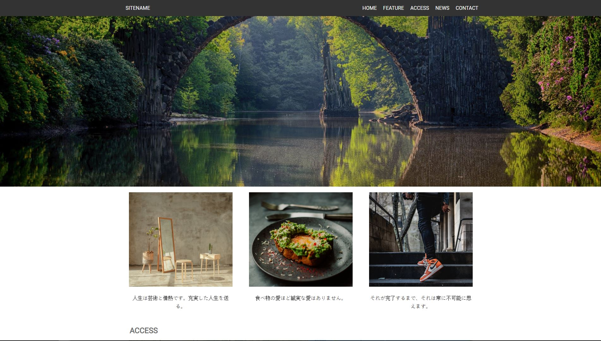

### One Page Japanese UI

This is my first layout created using scss and gulp

## Tools Used

- [GulpJS](https://gulpjs.com/)
- [SCSS](https://sass-lang.com/)

## Usage
In your project diretory run:
`npm install`

After that, run 
`gulp`

## License

One Page Japanese UI is an open-source software licensed under the [MIT license](https://opensource.org/licenses/MIT).
